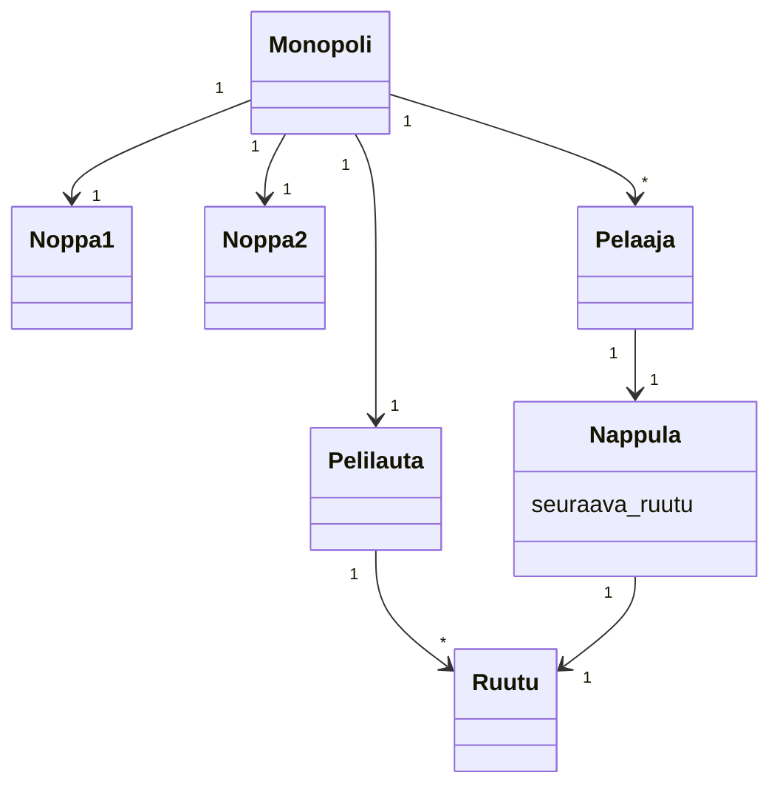

# Viikon 3 laskuharjoitusten kaaviot

## Tehtävä 1. Monopoli

```mermaid
	classDiagram
		Monopoli "1" --> "1" Pelilauta
		Monopoli "1" --> "1" Noppa1
		Monopoli "1" --> "1" Noppa2
		Monopoli "1" --> "*" Pelaaja
		Pelaaja "1" --> "1" Nappula
		Pelilauta "1" --> "*" Ruutu
		Nappula "1" --> "1" Ruutu
		
		class Nappula {
			seuraava_ruutu
		}
		
```
