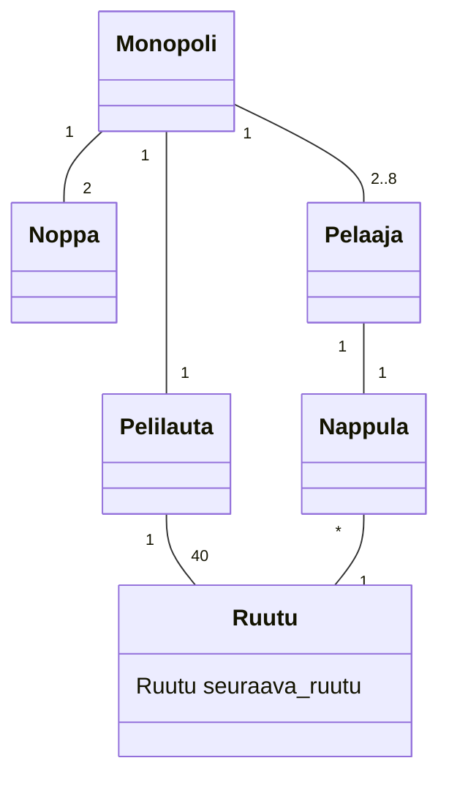

# Tehtävä 1. Monopolin luokkakaavio

```mermaid
	classDiagram
		Monopoli "1" -- "1" Pelilauta
		Monopoli "1" -- "2" Noppa
		Monopoli "1" -- "2..8" Pelaaja
		Pelaaja "1" -- "1" Nappula
		Pelilauta "1" -- "40" Ruutu
		Nappula "*" -- "1" Ruutu
		
		class Ruutu {
			Ruutu seuraava_ruutu
		}
		
```
