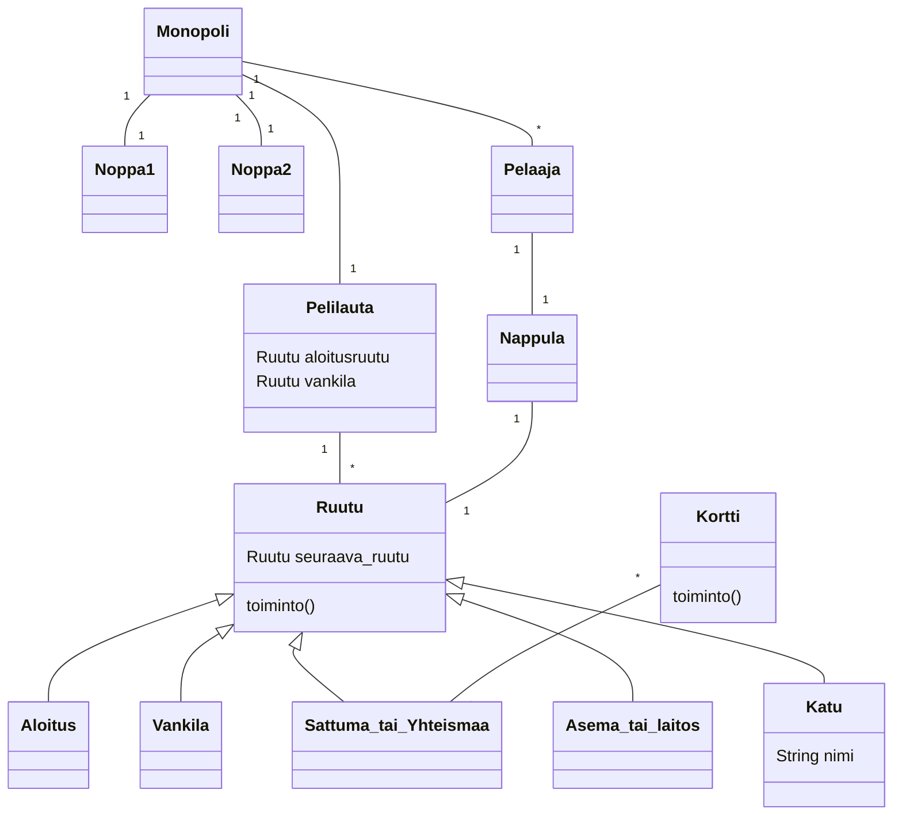

# Tehtävä 2. Laajennetun monopolin luokkakaavio

```mermaid
	classDiagram
		Monopoli "1" -- "1" Pelilauta
		Monopoli "1" -- "1" Noppa1
		Monopoli "1" -- "1" Noppa2
		Monopoli "1" -- "*" Pelaaja
		Pelaaja "1" -- "1" Nappula
		Pelilauta "1" -- "*" Ruutu
		Nappula "1" -- "1" Ruutu
		Ruutu <|-- Aloitus
		Ruutu <|-- Vankila
		Ruutu <|-- Sattuma_tai_Yhteismaa
		Ruutu <|-- Asema_tai_laitos
		Ruutu <|-- Katu
		Kortti "*" -- "*" Sattuma_tai_Yhteismaa
		
		class Ruutu {
			Ruutu seuraava_ruutu
			toiminto()
		}
		class Pelilauta {
			Ruutu aloitusruutu
			Ruutu vankila
		}
		class Kortti {
			toiminto()
		}
		class Katu {
			String nimi
		}
		
```
